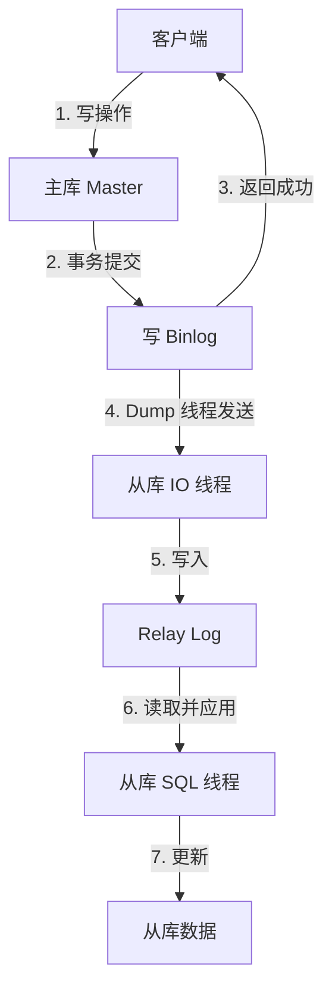

# MySQL 主从同步原理与实现

## 目录

1. [核心作用](#核心作用)
2. [核心原理：基于 Binlog 的日志复制](#核心原理基于-binlog-的日志复制)
3. [Binlog 的三种记录格式](#binlog-的三种记录格式)
4. [主从同步的三种模式](#主从同步的三种模式)
5. [GTID 复制机制](#gtid-复制机制)
6. [主从延迟原因与解决方案](#主从延迟原因与解决方案)
7. [常用配置参数](#常用配置参数)
8. [总结](#总结)

---

## 核心作用

主从同步（Replication）是 MySQL 实现**数据冗余、读写分离、高可用、故障恢复**的核心机制。

| 作用 | 说明 |
|------|------|
| **数据备份** | 从库实时备份主库数据 |
| **读写分离** | 主库写，从库读，分担压力 |
| **高可用** | 主库故障时，从库可切换为主库 |
| **容灾恢复** | 跨机房/跨地域部署从库 |

---

## 核心原理：基于 Binlog 的日志复制

MySQL 主从同步的本质是：**主库记录变更日志（Binlog），从库重放日志，使数据保持一致**。

### 三个核心日志文件

| 日志 | 位置 | 作用 |
|------|------|------|
| **Binlog** | 主库 | 记录主库所有数据变更（DDL、DML） |
| **Relay Log** | 从库 | 从库保存从主库拉取的 Binlog 事件 |
| **Master Info / Relay Log Info** | 从库 | 记录从库读取到主库 Binlog 的位置（file + position） |

### 核心流程图



### 详细步骤

1. **主库写 Binlog**
   - 客户端在主库执行写操作
   - 事务提交时，主库将变更写入 **Binlog**
   - `sync_binlog` 参数控制 Binlog 刷盘策略

2. **从库 IO 线程连接主库**
   - 从库启动 `IO_thread`，与主库建立连接
   - 向主库请求从某个位置（`file + position`）开始的 Binlog

3. **主库 Dump 线程发送 Binlog**
   - 主库为每个从库连接创建一个 `Binlog Dump` 线程
   - Dump 线程读取 Binlog 并发送给从库

4. **从库写入 Relay Log**
   - 从库 IO 线程接收 Binlog 事件
   - 写入从库的 **Relay Log**（中继日志）

5. **从库 SQL 线程重放**
   - `SQL_thread` 读取 Relay Log
   - 按顺序解析并执行其中的 SQL 事件
   - 应用到从库的数据库中

---

## Binlog 的三种记录格式

Binlog 是主从同步的基础，有三种格式：

| 格式 | 英文 | 特点 | 优缺点 |
|------|------|------|--------|
| **Statement** | 基于语句 | 记录原始 SQL 语句 | 体积小，但某些函数（如 UUID、NOW()）可能导致主从不一致 |
| **Row** | 基于行 | 记录每行数据变更前后的值 | 数据一致性高，但日志体积大 |
| **Mixed** | 混合模式 | 默认用 Statement，部分场景自动切换为 Row | 折中方案 |

> **MySQL 5.7+ 默认推荐 `ROW` 格式**，因为它能保证主从数据强一致。

---

## 主从同步的三种模式

| 模式 | 英文名 | 流程 | 优点 | 缺点 |
|------|--------|------|------|------|
| **异步复制** | Async Replication | 主库写 Binlog 后，不等待从库确认，直接返回客户端成功 | 性能最好，主库延迟低 | 主库宕机时，从库可能丢失最新数据 |
| **半同步复制** | Semi-Sync Replication | 主库等待至少一个从库确认收到 Binlog 后，才返回客户端成功 | 降低数据丢失风险 | 增加主库响应延迟 |
| **组复制** | Group Replication | 多个节点组成复制组，事务提交需组内大多数节点确认 | 强一致性、自动故障切换、多主写入 | 配置复杂、性能开销大、对网络延迟敏感 |

### 异步复制

```
客户端 ──► 主库写 Binlog ──► 立即返回成功
                              │
                              ▼
                        后台异步同步到从库
```

### 半同步复制

```
客户端 ──► 主库写 Binlog ──► 发送给从库
                              │
                         等待从库 ACK
                              │
                              ▼
                         返回客户端成功
```

### 组复制

基于 **Paxos 协议** 的强一致性复制，常用于 MySQL InnoDB Cluster。

---

## GTID 复制机制

GTID（Global Transaction Identifier）是 MySQL 5.6 引入的全局事务标识符，用于替代传统的 `file + position` 定位方式。

```
GTID = server_uuid:transaction_id
```

### 核心特点

- 每个事务在主库生成唯一的 GTID
- 从库根据 GTID 判断是否已经执行过该事务，避免重复执行
- 切换主库时更方便，不需要手动找 position

### 与传统复制的区别

| 对比项 | 传统复制 | GTID 复制 |
|--------|----------|-----------|
| 定位方式 | Binlog file + position | GTID 集合 |
| 主从切换 | 需要手动找位置 | 自动定位，避免跳号 |
| 事务追踪 | 不便追踪 | 每个事务有唯一 ID |

---

## 主从延迟原因与解决方案

### 延迟原因

| 原因 | 说明 |
|------|------|
| **从库性能差** | 从库硬件配置低，SQL 线程重放慢 |
| **大事务** | 主库一个事务修改大量数据，从库需要较长时间重放 |
| **锁冲突** | 从库上的读操作与 SQL 线程写操作产生锁等待 |
| **网络延迟** | 主从跨机房、跨地域部署 |
| **单线程复制** | MySQL 5.5 及以前版本 SQL 线程是单线程的 |

### 解决方案

1. **硬件升级**：提升从库配置
2. **并行复制**：开启 MTS（Multi-Threaded Slave）
3. **读写分离 + 延迟监控**：读请求尽量落在延迟小的从库
4. **分库分表**：减少单库压力
5. **避免大事务**：业务层拆大事务
6. **使用缓存**：降低从库读压力

---

## 常用配置参数

| 参数 | 说明 |
|------|------|
| `server-id` | 主从节点唯一标识，必须不同 |
| `log-bin` | 开启 Binlog |
| `binlog_format` | Binlog 格式（ROW/STATEMENT/MIXED） |
| `sync_binlog` | Binlog 刷盘策略 |
| `innodb_flush_log_at_trx_commit` | redo log 刷盘策略 |
| `read_only` | 从库设置只读 |
| `relay_log` | Relay Log 文件配置 |
| `gtid_mode` | 开启 GTID 复制 |
| `slave_parallel_workers` | 并行复制线程数 |

---

## 总结

> **MySQL 主从同步是基于 Binlog 的日志复制机制，主库将数据变更写入 Binlog，从库通过 IO 线程拉取并写入 Relay Log，再由 SQL 线程重放，从而实现数据一致性。根据同步确认方式可分为异步复制、半同步复制和组复制，生产环境中常结合 GTID、并行复制和读写分离来构建高可用架构。**
