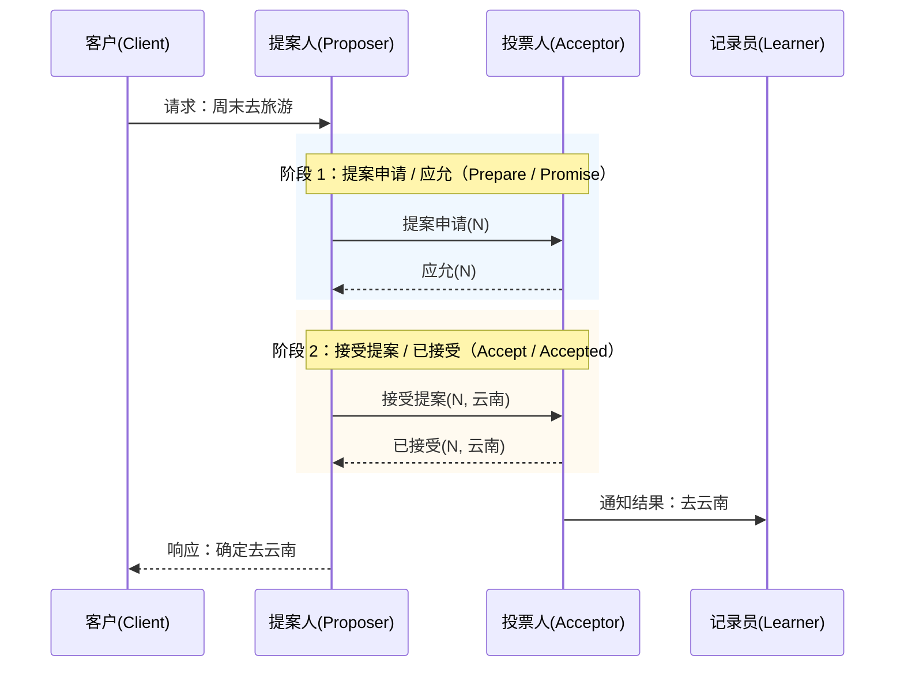
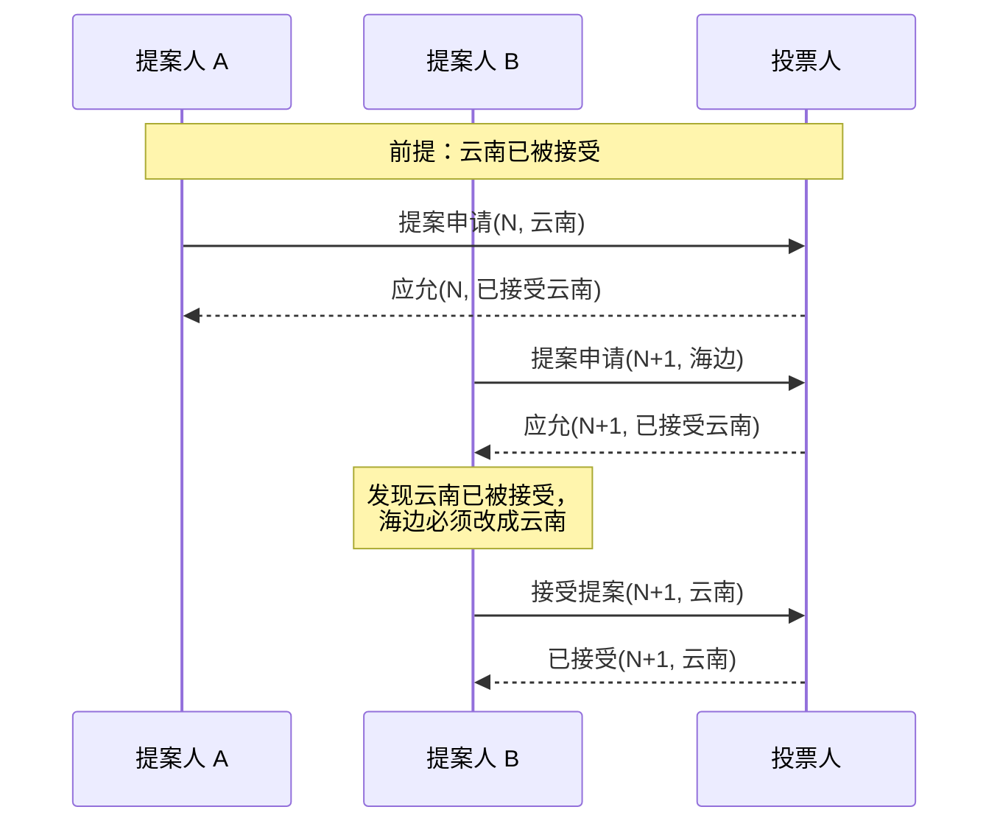
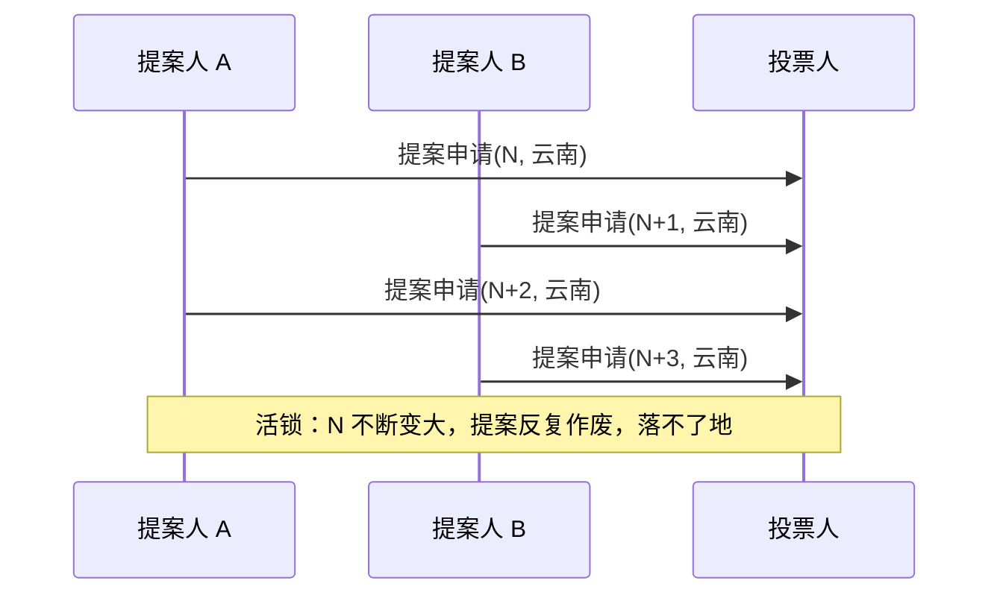

# Basic Paxos 一致性算法笔记（分布式共识算法 · 旅游场景版）

## 一、Basic Paxos 是什么

### 1. 算法背景

Basic Paxos 是由 Leslie Lamport 于 1990 年提出的一种基于消息传递的分布式一致性算法，用于让多个节点就某个值达成一致。

### 2. 旅游场景

假设周末要组织一次旅游，三个小伙伴 A、B、C 负责投票决定目的地。整个过程就像 Basic Paxos：

1. 先提案：组织者申请一个方案编号，询问大家能否接受（第一阶段只协商编号，不涉及具体目的地；这个申请本身就需要过半数人同意）
2. 再落地：编号被应允后，组织者才正式提出目的地，再次获得多数人同意后，最终目的地才算确定

---

## 二、角色与关系

### 1. 四种角色

| Paxos 角色 | 旅游场景角色 | 职责 |
|------------|------------|------|
| **Client** | 客户/发起者 | 说：周末去旅游 |
| **Proposer** | 提案人/组织者 | 提出去哪玩的方案 |
| **Acceptor** | 投票人（A、B、C 三人） | 对方案进行投票，需多数同意 |
| **Learner** | 记录员 | 只负责记录最终结果，不参与投票 |

### 2. 角色的本质

Proposer、Acceptor、Learner 都是**逻辑角色**，不是固定身份：

- **Proposer 可以是 A/B/C 中的一员，也可以是外部节点**：A 既负责组织也参与投票；也可以专门请个导游来组织，A/B/C 只投票
- **多个节点都能当 Proposer**：Basic Paxos 允许，但容易引发冲突
- **Learner 不参与投票**：可以是外部节点，也可以是 A/B/C 中的任意一个或多个，甚至全部兼任

**一句话总结**：角色按职责划分，同一个节点可以同时担任多个角色；但一次提案最好只有一个 Proposer，否则容易活锁。

---

## 三、两阶段流程与核心机制

### 1. 正常流程时序图

### 2. 两阶段流程

| 阶段 | 英文名 | 中文名 | 旅游场景解释 |
|------|--------|--------|--------------|
| Phase 1 上半 | **Prepare** | **提案申请** | 组织者说：我要提一个方案 N，你们看看能同意吗？ |
| Phase 1 下半 | **Promise** | **应允** | 投票人说：行，我应允只接受编号大于 N 的方案 |
| Phase 2 上半 | **Accept** | **接受提案** | 组织者说：那我们就定 **云南**，编号 N |
| Phase 2 下半 | **Accepted** | **已接受** | 投票人说：同意，最终方案就是 **云南** |

### 3. Quorum 与过半数

**Quorum** 是法定人数，也就是**过半数**。

A、B、C 三人投票，只要 **2 人及以上同意** 就算通过。为什么要过半数？因为任意两个过半数投票组一定有重叠的人。老方案通过后，新方案的投票人中总有人知道这件事，会阻止改值，所以新提案必须沿用老方案。

> 这就是 Paxos 的铁律：**一旦某个值被接受，后续编号更大的提案必须使用相同的值。**
>
> 例如 Proposer 2 本来想提去海边，但发现有投票人已经接受过 "云南"，那么它最终也只能提 "云南"。

### 4. 一致性保证图示

### 5. 还没被接受的提案会被覆盖吗？

会。**一致性保证只针对"已经被半数接受"的值。**

如果一个提案还没收到半数同意，它就不算"已通过"，后续更高编号的提案完全可以覆盖它。

例如：

1. Proposer A 发 N=1，云南
2. 只有 1 个投票人接受，没达到半数
3. Proposer B 发 N=2，海边
4. 投票人会因为 N=2 > N=1，应允接受 N=2
5. Proposer A 的 N=1 云南实际上就被覆盖了

这就是活锁产生的根本原因：**在没有任何一个值达到半数接受之前，多个 Proposer 互相抢占编号，谁都落不了地。**

---

## 四、安全性、活性与核心问题

### 1. 安全性与活性

| 性质 | 含义 | 旅游场景 |
|------|------|---------|
| **安全性（Safety）** | 一旦值被选定，就永远不会被改变 | 一旦确定去云南，就不能反悔改海边 |
| **活性（Liveness）** | 合理条件下，最终一定能达成一致 | 只要网络正常、多数人在线，一定能定下来 |

Paxos 优先保证**安全性**，宁可达不成一致，也不能给出错误结果。

### 2. 核心问题

| 问题 | 说明 | 旅游场景 |
|------|------|---------|
| **活锁** | 多个 Proposer 不断用更高编号抢占，提案落不了地 | A 发 N=1 去云南，B 发 N=2 去云南，A 又发 N=3 去云南……N 不断变大，反复作废 |
| **效率低** | 两阶段网络交互多 | 每次定目的地都要先问一遍、再确认一遍 |

**解决思路**：选举 Leader 作为唯一 Proposer（Multi-Paxos），减少冲突、复用第一阶段。

### 3. 活锁问题图示

---

## 五、Basic Paxos 的局限性

### 1. 只能对一个值达成一致

Basic Paxos 只能就**单个值**达成一致。如果要决定 "周六去哪、周日去哪、周一去哪"，就要重复运行多次。

### 2. 效率不高

每次达成一致都要经过完整两阶段，通信开销大。

### 3. 工程优化

| 方案 | 核心思想 |
|------|---------|
| **Multi-Paxos** | 选举稳定 Leader，复用第一阶段，只走第二阶段 |
| **Raft** | 受 Multi-Paxos 启发，更易理解和实现 |

---

## 六、一句话总结

> **Basic Paxos 通过"两阶段 + 过半数"让多个节点就一个值达成一致：先提案申请并应允，再接受提案并落地；一旦值被接受，后续提案必须沿用该值；工程上常用 Multi-Paxos 或 Raft 来优化效率和连续性。**
