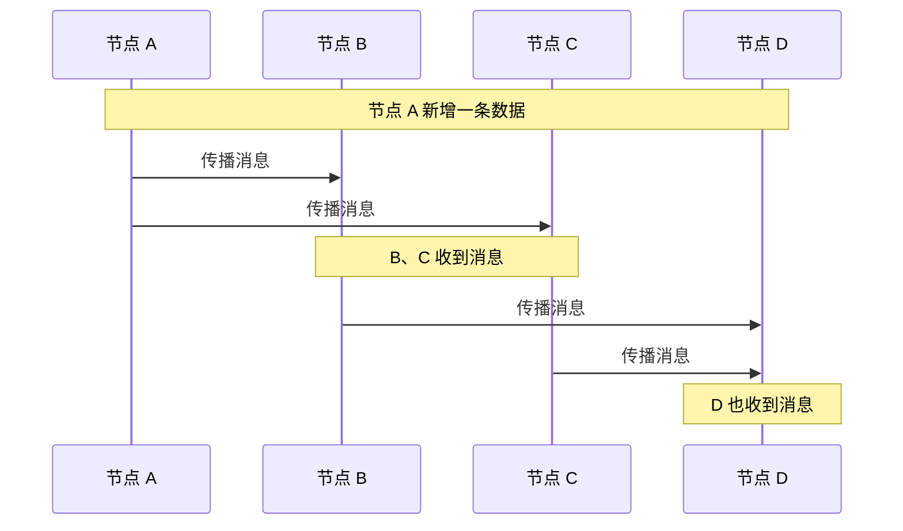

# Gossip 协议笔记（分布式系统中的信息传播 / 最终一致协议）

## 一、Gossip 是什么

Gossip 是一种**去中心化的分布式信息传播协议**，灵感来自流言蜚语（gossip）——消息像村里传八卦一样，在节点之间随机、逐步扩散。

它和 Raft/Paxos 最大的区别：

- **Raft/Paxos**：强一致，集群必须就某个值达成一致才能继续
- **Gossip**：最终一致，允许短时间内节点数据不一致，但最终会收敛到一致

---

## 二、Gossip 的传播方式

### 1. 反熵（Anti-Entropy）

节点之间定期随机交换信息，发现差异后互相修复，最终达到一致。

### 2. 流行病传播（Rumor-Mongering）

新消息像病毒一样传播：

1. 节点 A 知道一个新消息
2. A 随机告诉 B、C
3. B、C 再随机告诉其他节点
4. 最终几乎所有节点都知道这个消息

---

## 三、Gossip 的工作流程

---

## 四、Gossip vs 强一致协议

| 对比项 | Raft / Paxos | Gossip |
|--------|--------------|--------|
| **一致性** | 强一致 | 最终一致 |
| **Leader** | 有 Leader | 无 Leader |
| **扩展性** | 较差，Leader 是瓶颈 | 很好，节点数增加不影响单节点压力 |
| **写入延迟** | 低（Leader 本地写） | 低（本地写后异步传播） |
| **读一致性** | 可通过 ReadIndex / Lease Read 保证 | 可能读到旧数据 |
| **容错性** | 强，但需选举 Leader | 很强，节点随时加入退出 |
| **适用规模** | 小到中等规模集群 | 大规模集群 |

---

## 五、Gossip 的优缺点

### 优点

- **去中心化**：没有单点故障
- **可扩展性强**：节点数增加不会显著增加单节点负担
- **容错性好**：部分节点故障不影响整体服务
- **实现简单**：没有复杂的 Leader 选举和日志复制

### 缺点

- **最终一致**：无法避免读到旧数据
- **收敛时间不确定**：节点越多，消息传遍全集群越慢
- **去重复杂**：同一个消息可能被多次传播

---

## 六、典型应用场景

| 场景 | 说明 |
|------|------|
| **集群状态传播** | 节点上下线、心跳信息扩散 |
| **配置下发** | 配置变更后逐步同步到所有节点 |
| **DNS / 服务发现** | 节点信息在各节点间同步 |
| **分布式数据库** | Cassandra、Riak 等使用 Gossip 传播集群拓扑 |
| **区块链** | 交易和区块在节点间广播 |

---

## 七、一句话总结

> **Gossip 通过去中心化的随机传播实现最终一致，牺牲了强一致性，换来了高容错和高可扩展，是强一致协议（如 Raft/Paxos）在大规模集群场景下的重要补充。**
