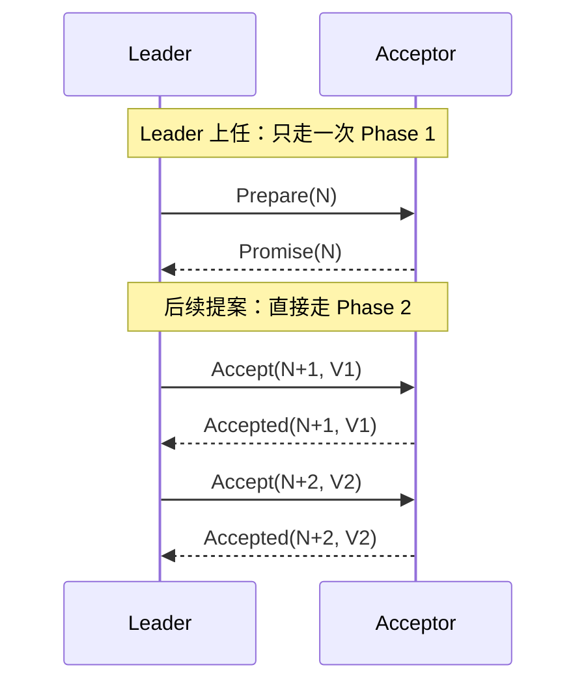

# Multi-Paxos 笔记（分布式共识算法）

## 一、Multi-Paxos 是什么

Multi-Paxos 是 Basic Paxos 的**工程化改进版本**，主要解决 Basic Paxos 的两个核心问题：

1. **活锁**：多个 Proposer 互相抢占编号，谁也落不了地
2. **效率低**：每个值都要走完整两阶段，无法连续处理多个值

---

## 二、核心思想

| 改进点 | Basic Paxos | Multi-Paxos |
|--------|-------------|---------------|
| **Proposer** | 多个，可能冲突 | 选举一个 Leader，唯一 Proposer |
| **活锁** | 存在 | 消除 |
| **阶段复用** | 每个提案都走两阶段 | Leader 上任时走一次 Phase 1，后续只走 Phase 2 |
| **一致范围** | 单个值 | 连续多个值，形成日志 |

### 1. 选举 Leader

通过某种机制选举出一个 Leader，由 Leader 作为唯一 Proposer 发起提案。

> 旅游场景：大家选出一个"团长"，以后所有方案都由团长来组织，其他人不抢。

### 2. 消除活锁

只有一个 Proposer，自然不会再出现多个 Proposer 互相抢占编号的情况。

### 3. 复用第一阶段

Leader 是集群选举出来的，不是由 Phase 1 选出来的。Leader 上任时走一次 Phase 1：

```
Prepare(N) → Promise(N)
```

这一步相当于一次性拿到了后续所有提案的"应允权"。之后连续提案直接走 Phase 2：

```
Accept(N+1, V1) → Accepted(N+1, V1)
Accept(N+2, V2) → Accepted(N+2, V2)
...
```

注意：Phase 2 仍然需要过半数 Acceptor 的 Accepted，不是 Leader 一个人说了算。

### 4. 连续提案 / 日志复制

按顺序对一系列值达成一致，每个提案对应一个日志条目，形成连续的日志序列。

---

## 三、工作流程



1. **选主**：集群选举出 Leader
2. **上任**：Leader 走一次 Phase 1，确认是否有已接受但自己不知道的值
3. **连续提案**：直接走 Phase 2，按顺序复制日志

---

## 四、仍面临的问题

Multi-Paxos 只解决了“有 Leader 后如何高效复制日志”，但**Leader 怎么来、怎么换、分区后怎么办**，算法本身都没有定义，需要工程实现补充。

| 问题 | 说明 |
|------|------|
| **Leader 选举** | 只提出应选举 Leader，**未定义如何产生**（超时投票、外部指定、固定主节点等均可） |
| **Leader 故障** | 宕机后需重新选举，但**多久算失效、由谁发起、如何上任均未定义**，期间无法处理新提案 |
| **网络分区** | **未定义** Leader 与多数节点失联后是否自动卸任，实现不当可能出现双主或脑裂 |

> 对比 Raft：Raft 把 Leader 选举、故障转移、网络分区处理都明确定义为算法的一部分，因此更易实现。

---

## 五、与 Raft 的关系

| 算法 | 定位 |
|------|------|
| **Basic Paxos** | 理论上证明共识的经典模型 |
| **Multi-Paxos** | Basic Paxos 的工程化优化 |
| **Raft** | 受 Multi-Paxos 启发，设计更清晰、更易实现的共识算法 |

---

## 六、一句话总结

> **Multi-Paxos 通过选举 Leader 消除了 Basic Paxos 的活锁，并通过复用第一阶段实现了连续日志复制。Raft 是其工程化的更优实践。**
