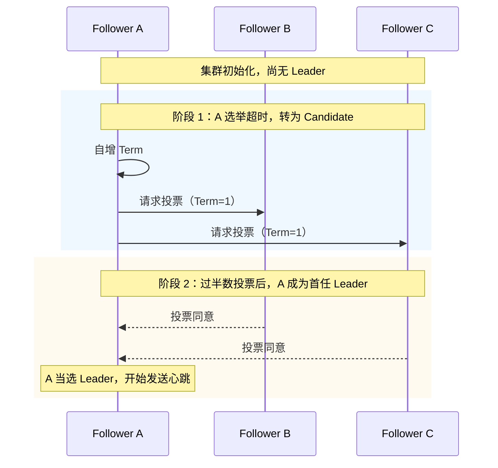
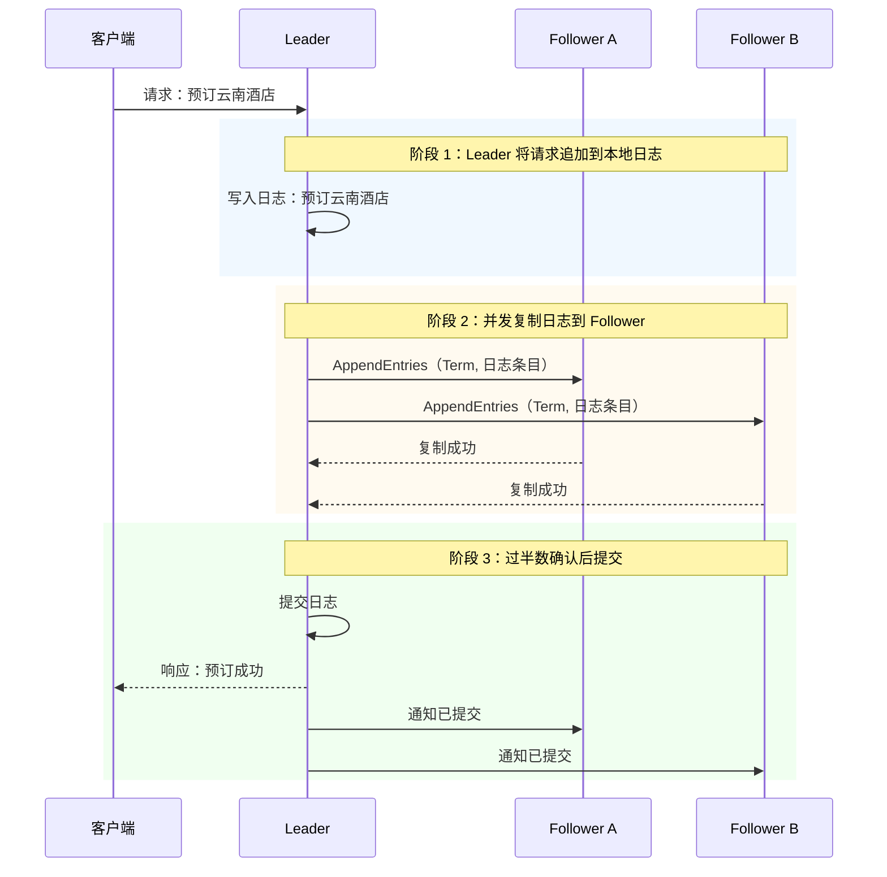

# Raft 一致性算法笔记（分布式共识算法）

## 一、Raft 是什么

Raft 是一种**工程化、易理解的分布式共识算法**，由 Diego Ongaro 和 John Ousterhout 于 2013 年提出。它在功能上等价于 Multi-Paxos，但将共识问题拆分成三个清晰、独立的部分：

1. **领导选举（Leader Election）**：谁来主导提案
2. **日志复制（Log Replication）**：如何把提案复制到多数节点
3. **安全性（Safety）**：保证已提交的日志不会被覆盖

> 设计目标：**在保证正确性的前提下，比 Paxos 更容易理解和实现**。

---

## 二、角色定义

| Raft 角色 | 旅游场景角色 | 职责 |
|----------|------------|------|
| **Leader** | 团长 | 唯一的提案发起者，负责接收客户端请求并指挥日志复制 |
| **Follower** | 普通团员 | 被动接收 Leader 的指令，复制日志；不主动发起提案 |
| **Candidate** | 竞选者 | Leader 失联后，Follower 转为 Candidate，发起选举竞争团长 |

**一句话**：正常运行时只有一个 Leader，其余都是 Follower；Leader 故障时，Follower 升级为 Candidate 竞选新 Leader。

---

## 三、核心机制

### 1. 任期（Term）

Raft 将时间划分为**一段一段的任期（Term）**，类似「届数」，每个任期最多只有一个 Leader。

- 任期单调递增
- 每个节点只投给任期大于等于自己的 Candidate
- 如果节点发现自己的任期落后，会主动更新为更大任期

### 2. 领导选举

集群刚启动时，所有节点都是 Follower。每个节点会设置一个**随机的选举超时时间**，谁先超时，谁就自增任期并转为 Candidate，向其他节点请求投票。获得过半数选票后，该 Candidate 成为 Leader。

> 注意：不是说 A 有特权当 Leader，而是 A 的随机计时器刚好最先到期。B 或 C 也完全可能先超时并当选，这里只是用 A 作为示例。

**选举超时时间的典型范围**：

| 参数 | 典型值 | 说明 |
|------|--------|------|
| **选举超时时间** | 150ms ~ 300ms | 节点在这个范围内随机选择一个值，避免多个节点同时超时 |
| **心跳间隔** | 远小于选举超时时间（通常 50ms 左右） | Leader 定期发送心跳，刷新 Follower 的超时计时器 |

随机化的目的是**防止多个 Follower 同时超时、同时发起选举，导致选票瓜分、谁也过不了半数**。



**选举规则**：

- Candidate 必须获得**过半数**选票才能成为 Leader
- 每个 Follower 在一个任期内只能投一票
- 如果多个 Candidate 同时发起选举，可能都未过半，触发新一轮选举（通过随机超时避免长期平局）

**时间约束**：

Raft 要求三个时间参数满足以下关系：

```
广播时间 << 选举超时时间 << 平均故障间隔时间
```

- **广播时间**：Leader 发送 AppendEntries 到收到过半数响应的平均耗时
- **选举超时时间**：Follower 等待心跳的超时时间
- **平均故障间隔时间**：节点两次故障之间的平均时间

这样能保证 Leader 正常时 Follower 不会误触发选举，同时 Leader 故障后又能及时选举出新 Leader。

### 3. 日志复制

Leader 接收客户端请求后，将操作封装成**日志条目（Log Entry）**，然后并发地发送给所有 Follower；当超过半数的 Follower 确认复制成功后，这条日志就可以**提交（Commit）**，并返回客户端。



**关键点**：

- 只有 Leader 能处理客户端写请求
- 日志按顺序复制，Follower 必须**严格按 Leader 的日志顺序**追加
- 提交（Commit）意味着该日志已持久化到过半数节点，不可丢失
- **过半数包含 Leader 自己**：例如 3 节点集群，Leader 本地已有 1 份，只需再收到 1 个 Follower 确认即可提交

### 4. AppendEntries 是什么

`AppendEntries` 是 Raft 中 **Leader 向 Follower 复制日志并维持心跳的核心 RPC**。

字面意思：`Append`（追加）+ `Entries`（日志条目），即「把日志条目追加过去」。

**主要作用**：

- **复制日志**：Leader 把新的日志条目发送给 Follower
- **维持心跳**：没有新日志时，发送空的 `AppendEntries` 作为心跳
- **通知提交**：告诉 Follower 当前已提交的日志索引

**一句话**：`AppendEntries` 是 Leader 同步日志和维持心跳的「二合一」RPC。

### 5. 安全性

Raft 通过以下核心规则保证安全：

| 规则 | 说明 |
|------|------|
| **选举安全（Election Safety）** | 一个任期内最多只能有一个 Leader |
| **Leader Append-Only** | Leader 只能追加日志，不能覆盖或删除已有日志 |
| **Leader 完整性（Leader Completeness）** | 已被提交的日志条目，后续的 Leader 一定拥有它 |
| **日志匹配（Log Matching）** | 如果两条日志的任期和索引相同，则它们之前的所有日志都相同 |
| **状态机安全（State Machine Safety）** | 如果某个节点把某条日志 apply 到了状态机，其他节点不会在同一索引 apply 不同的日志 |

**如何保证？**

- Candidate 在拉票时，会附带自己日志的最新信息
- Follower 只投给**日志至少和自己一样新**的 Candidate
- 因此，新 Leader 一定包含所有已提交的日志，不会覆盖已提交记录

**为什么已提交的日志不会丢失？**

已提交的日志至少被**过半数节点**保存，而新 Leader 必须获得**过半数**选票。这两个「过半数」之间一定存在交集，所以至少有一个保存了已提交日志的节点会参与投票。该节点只会把票投给日志至少和自己一样新的 Candidate，因此最终当选的新 Leader 一定也拥有这些已提交日志。

> 注意：已提交日志也可能**暂时缺失**在某些 Follower 上。新 Leader 上任后，会通过日志复制机制把这些缺失的已提交日志同步给 Follower，而不是覆盖它们。

**提交限制规则**

Raft 规定：**Leader 不能直接提交旧任期的日志，只能提交当前任期的日志**。旧任期的日志会随当前任期日志的提交而被间接提交。

这样设计是为了避免这种情况：旧 Leader 把某条旧任期日志复制到了多数节点但还没提交，然后旧 Leader 挂了。如果新 Leader 因为「这条日志已经在多数节点上」就提交它，而新 Leader 随后也挂了，那么后续选举出的 Leader 可能不包含这条日志，导致已提交的日志被覆盖。

通过「只提交当前任期日志」的规则，Raft 保证了任何被提交的日志，后续 Leader 一定都有。

---

## 四、Raft 与 Multi-Paxos 的关系

| 对比项 | Multi-Paxos | Raft |
|--------|-------------|------|
| **Leader 选举** | 算法未定义，由工程实现补充 | 算法内置，有明确的选举规则 |
| **任期概念** | 提案编号 | 显式的 Term / 任期 |
| **日志复制** | 复用 Phase 1，连续走 Phase 2 | AppendEntries RPC，心跳驱动 |
| **安全性保证** | 依赖 Quorum 和 Promise | 选举安全 + Leader Append-Only + Leader 完整性 + 日志匹配 + 状态机安全 + 提交限制 |
| **易实现性** | 较抽象，细节多 | 拆分清晰，更容易编码实现 |

**一句话关系**：Raft 和 Multi-Paxos 解决的是同一类问题，但 Raft 把 Leader 选举、故障转移等工程细节都明确写进了算法里，因此更易于理解和落地。

---

## 五、进阶内容

> 关于 **网络分区处理、日志压缩、成员变更、读一致性优化** 等工程化内容，参见 [Raft-进阶-分布式共识算法.md](Raft-进阶-分布式共识算法.md)。

---

## 六、一句话总结

> **Raft 通过任期驱动的领导选举和过半数日志复制，让集群在 Leader 正常时高效达成共识，在 Leader 故障时自动完成选举与恢复；它将抽象的共识问题拆分为领导选举、日志复制、安全性三个独立部分，是工程化实现分布式一致性的主流选择。**
