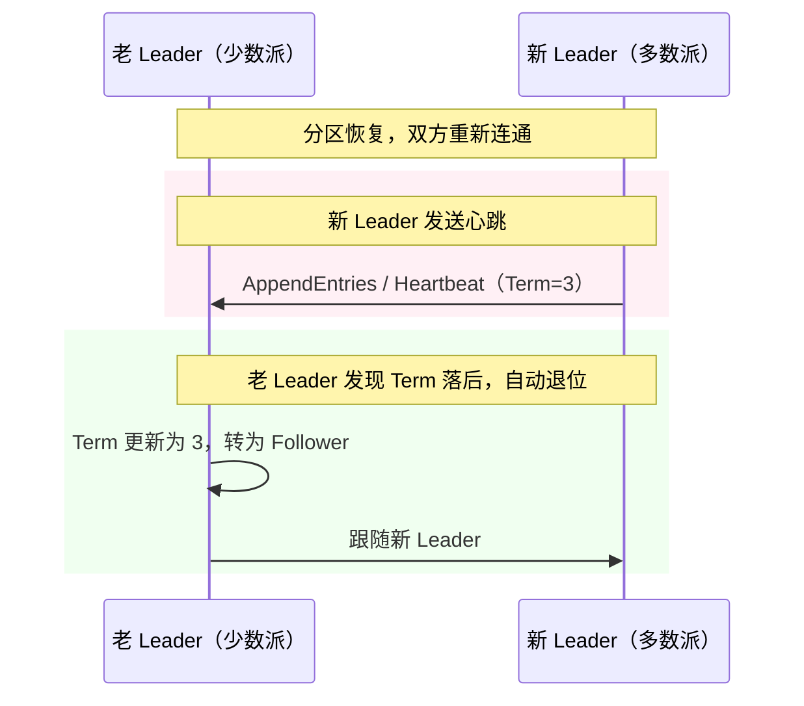
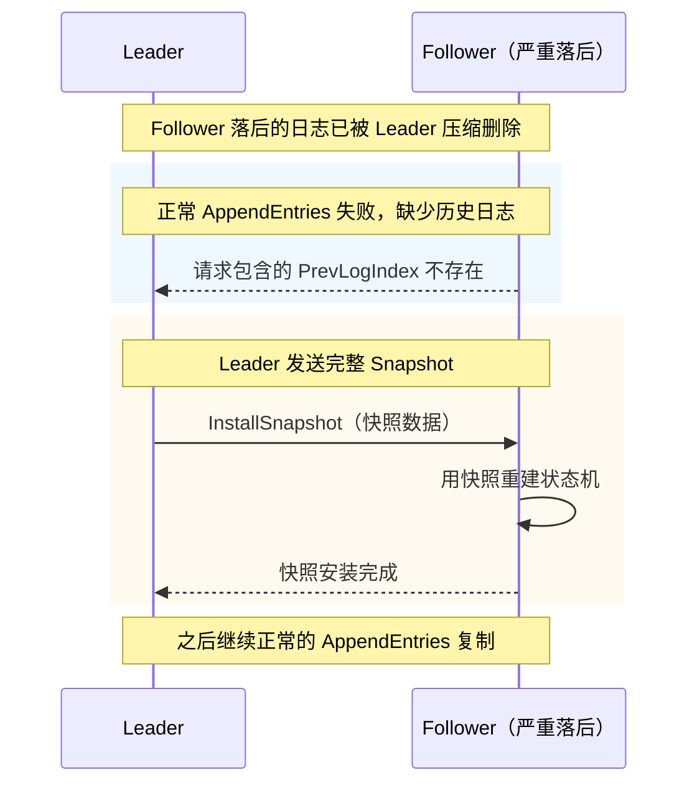
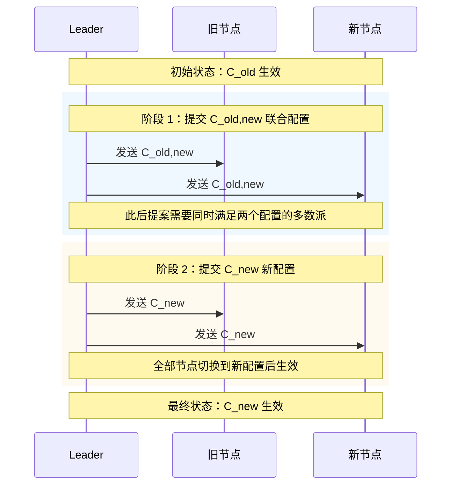
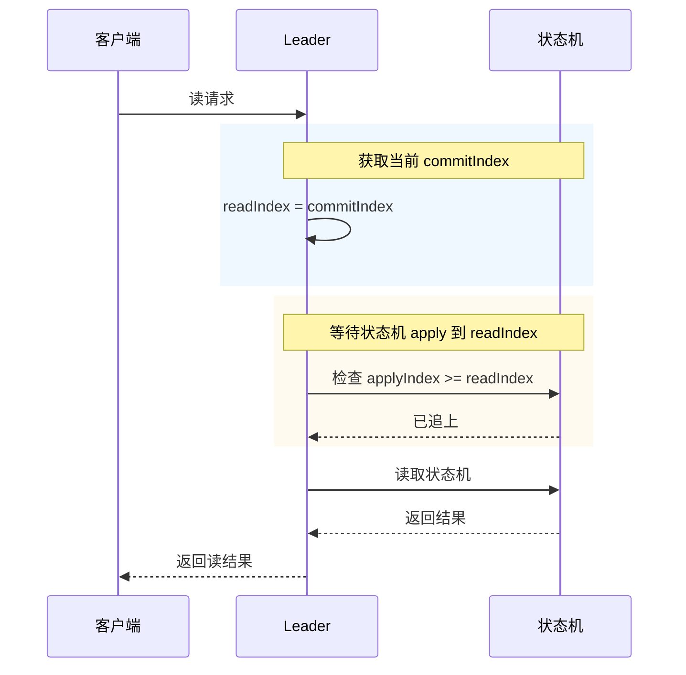
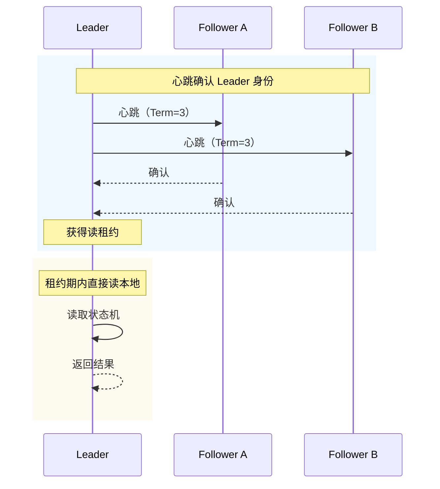

# Raft 进阶笔记（分布式共识算法 · 工程化补充）

> 本篇聚焦 Raft 在工程落地时常见的四个进阶问题：网络分区处理、日志压缩、成员变更、读一致性优化。
> 关于 Raft 的核心机制（领导选举、日志复制、安全性等），参见 [Raft-分布式共识算法.md](Raft-分布式共识算法.md)。

---

## 一、网络分区与脑裂处理

### 1. 网络分区场景

当网络出现故障，把集群分成「小岛」时，可能原 Leader 刚好被隔离到少数派这边。此时：

- **少数派那边**：老 Leader 还在，但凑不齐过半数确认，写请求无法提交
- **多数派那边**：Follower 收不到心跳，会选举出新 Leader 继续工作

等网络恢复后，少数派那边的节点日志一定落后于多数派，会自动跟随新 Leader。

### 2. Term 如何解决脑裂

老 Leader 在分区后任期不变，而新 Leader 的任期更大。分区恢复、双方重新连通后：

1. 老 Leader 收到新 Leader 的心跳或 AppendEntries
2. 老 Leader 发现自己的 Term 更小
3. 老 Leader 主动更新 Term 并退位为 Follower

### 3. 关键点

| 问题 | 解决方案 |
|------|---------|
| **双 Leader** | 任期机制保证只有 Term 大的 Leader 能真正推进日志 |
| **少数派写请求** | 无法过半数确认，提交不了，不会破坏一致性 |
| **恢复后数据一致性** | 少数派节点日志回滚或补全，自动与新 Leader 对齐 |

**一句话**：Raft 通过任期机制和过半数原则，确保网络分区时只有一个有效 Leader，避免真正的脑裂。

---

## 二、日志压缩（Snapshot）

### 1. 为什么需要日志压缩

如果日志无限增长，会带来两个问题：

1. **存储无限膨胀**：磁盘总有一天会被占满
2. **新节点加入或重启恢复慢**：需要回放大量历史日志

### 2. Snapshot 原理

Raft 通过**快照（Snapshot）**压缩日志：

1. 把已提交的日志条目依次应用到状态机
2. 把状态机的当前状态持久化成一个「快照」
3. 删除快照覆盖范围之前的旧日志

### 3. 触发方式

| 触发方式 | 说明 |
|---------|------|
| **大小阈值** | 当日志大小或条目数超过阈值时触发 |
| **定时触发** | 每隔一段时间自动生成一次快照 |
| **手动触发** | 运维人员手动执行快照 |

**一句话**：Snapshot 把历史日志「封存」成快照，避免日志无限增长，也加速了故障恢复和新节点加入。

---

## 三、成员变更（Joint Consensus）

### 1. 直接变更配置的风险

集群成员不是一成不变的，可能需要扩容或缩容。如果直接从旧配置切换为新配置，可能出现：

- 不同节点在不同时间切换配置
- 旧配置的多数派和新配置的多数派同时存在
- 两个多数派各自选出 Leader，导致脑裂

### 2. Joint Consensus 三阶段

Raft 采用**联合共识（Joint Consensus）**来安全地变更成员。

### 为什么要分三阶段

直接切换配置会有风险：不同节点在不同时间切到新配置，可能旧配置的多数派和新配置的多数派同时存在，各自选出 Leader，造成脑裂。

**类比**：旅游团要换一批团员。如果直接宣布「现在按新名单投票」，但有人还没收到通知，就可能出现「旧名单的人还在按旧规矩选团长，新名单的人已经按新规矩选了另一个团长」。Joint Consensus 的做法是：让新旧名单同时生效一段时间，任何决策都必须同时得到新旧两拨人的多数同意，这样就不会各选各的。

### 三阶段

| 阶段 | 配置 | 含义 |
|------|------|------|
| **C_old** | 旧配置 | 变更前，只按旧配置投票 |
| **C_old,new** | 新旧配置同时生效 | 提案必须同时获得旧配置和新配置的过半数同意 |
| **C_new** | 新配置 | 变更完成后，只按新配置投票 |

### 3. 配置切换由谁触发

**不是 Follower 自发切换，而是由 Leader 主导、通过日志复制推进的。**

流程如下：

1. Leader 收到成员变更请求
2. Leader 把新配置作为一条特殊的日志条目写入本地
3. Leader 通过 `AppendEntries` 把这条配置日志复制给 Follower
4. 配置日志提交后，各节点在 apply 这条日志时切换到新配置

这样能保证所有节点按统一节奏切换，不会出现 A 已经切了新配置、B 还在旧配置的情况。

### 4. 关键点

- **任意时刻不会同时存在两个独立多数派**：因为 C_old,new 阶段必须同时满足新旧两个多数派
- **配置切换由 Leader 统一推进**：Follower 在 apply 配置日志时才切换，不是自己决定
- **Leader 不一定需要是新配置中的节点**：但通常推荐 Leader 在变更完成前先卸任或迁移
- **安全性优先**：成员变更宁可慢一点，也不能让集群出现两个决策中心

**一句话**：成员变更不是原子切换，而是让新旧配置先共同生效一段时间，保证任何时刻都不会出现两个独立多数派。

---

## 四、读一致性优化

### 1. 直接读 Leader 的问题

虽然 Leader 拥有最新的已提交日志，但直接读 Leader 仍可能读到不一致的数据：

- **日志已提交但还没 apply 到状态机**：Leader 本地虽然已有最新日志，但状态机还没来得及 apply，此时直接读状态机会读到旧数据
- **读 Follower 时可能读到落后数据**：Follower 可能还没收到 Leader 的最新日志
- **未提交的日志读不到**：状态机只 apply 已提交的日志，未提交的数据不会出现在读结果中

### 2. ReadIndex

**ReadIndex** 是最稳妥的线性一致读方案，核心思路是「状态机先追上已提交的日志，再返回读结果」：

1. Leader 确认当前已提交日志的最新位置
2. 等待本地状态机 apply 到这个已提交位置
3. 状态机追到这个位置后，再读取并返回结果

> 注意：状态机追的是**已提交日志**的位置，不是 Leader 本地未提交的日志。

**优点**：强一致，不依赖时钟同步。

**代价**：需要等待 apply，延迟稍大。

### 3. Lease Read

**Lease Read** 是 ReadIndex 的性能优化版：Leader 通过心跳确认自己还是 Leader 后，在一段时间内直接读本地状态机，不用等 apply。

1. Leader 正常发送心跳，确认自己仍然是 Leader
2. 确认后的一段时间内，直接读本地状态机
3. 这段时间过了之后，下一次读要先确认自己还是 Leader

**优点**：延迟低、吞吐高。

**风险**：如果节点时钟漂移，可能 Lease 还没过期时已经出现新 Leader，导致读到过期数据。

> **什么是时钟漂移？**
>
> 就是不同机器的时钟走得不一样快。比如 Leader 以为自己还在租约期内，但 Follower 的时钟走得快，已经认为 Leader 失联并选出了新 Leader。此时旧 Leader 仍然提供读服务，客户端就可能读到过期数据。

### 4. 方案对比

| 方案 | 原理 | 优点 | 风险 |
|------|------|------|------|
| **ReadIndex** | 等状态机追上最新已提交日志后读 | 强一致，无时钟依赖 | 延迟稍大 |
| **Lease Read** | 心跳确认后的一段时间内直接读本地 | 延迟低、吞吐高 | 时钟漂移可能读到过期数据 |

**一句话**：读操作也要经过一致性校验，ReadIndex 稳妥，Lease Read 性能更好但需要可信时钟。

---

## 五、进阶内容总结

| 问题 | 核心思路 | 关键点 |
|------|---------|--------|
| **网络分区** | 任期 + 过半数 | 老 Leader 在少数派无法提交，新 Leader 通过更大任期让老 Leader 退位 |
| **日志压缩** | Snapshot | 把历史日志封存成快照，加速恢复和节省存储 |
| **成员变更** | Joint Consensus | 新旧配置共同生效，避免同时存在两个多数派 |
| **读一致性** | ReadIndex / Lease Read | 读前确保 Leader 有效且日志已 apply |

---

## 六、一句话总结

> **Raft 的核心机制之外，网络分区处理、日志压缩、成员变更和读一致性优化是工程落地时必须面对的问题；它们共同让 Raft 从一个理论共识算法，变成一套可在生产环境中稳定运行的分布式一致性方案。**
